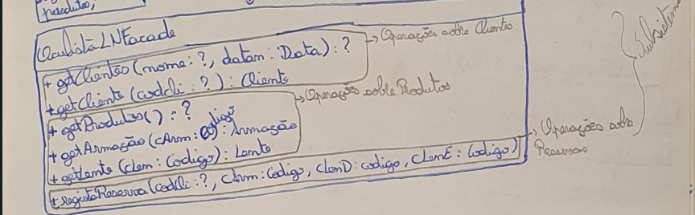
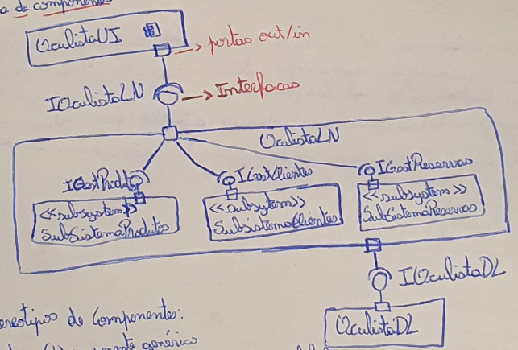

# API's e subsistemas

Estes proximos diagrams precisam que os diagrams de dominio e de use cases estejam completos. Ao rever os modelos anteriores, devemos definir as responsabilidades:

| OculistaLN |
|:---:|
|- procura clientes;|
|- procura cliente;|
|- procura detalhes doa produtos;|
|- regista reserva dos produtos;|

      ^
      |
    Responsabilidade que a logica de negocios tem que cumprir para satisfazer o use caase! - cf.guiado pelos Use Cases

    API da logica de negocios para suportar os Use Cases.
      |
      v

## Diagrama de componentes

Alguns estereotipos de componentes:
 - << Component >> - (!) componente genérico;
 - << subsystem >> - decomposição hierarquica do sistema global;
 - << process >> - componente transacional;
 - << service >> - componente funcional sem estado;

Em DSS adoptamos o seguinte método para a passagem sistemática de UC's para DSS:
 - dividimos os fluxos em sequências de transações;
 - identificamos responsabilidades da lógica de negocio;
 - identificamos metodos;
 - agrupamos metodos em subsistemas;