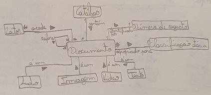
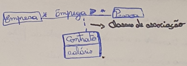
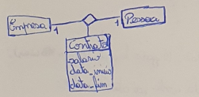

# Modelo de Dominio

O modelo ded dominio captura as Entiddades (coisas) do problema e os relacionamentos entre elas;
 - Captura o vocabulario do domínio do problema - fornece um glossário de termos;
 - Fornece uma framework conceptual para raciocinar sibre o problema - ajuda a pensar;

É uma visão estatisca do problema - permite representar regras de negócio invariantes no tempo;
É a base da análise de requisitos;

**Exemplo**: O sistema a desenvolver dedverá gerir catálogos. Um catálogo contém documentos que são acedidos por leitores. Um documento pode ser do tipo áudio, imagem, video ou texto e tem sempre um número de registo e uma classificação etária. Cada documento pode referir outros documentos.

Entidades:
 - Catálogo;
 - Documento;
 - Leitor;
 - Áudio;
 - Imagem;
 - Vídeo;
 - Texto;
 - Número de registo;
 - Classificação etária;

## Relações entre entidades
 - \* - zero ou mais objetos;
 - n - n objetos (n>=1);
 - n..m - entre n e m objetos (n<m);

