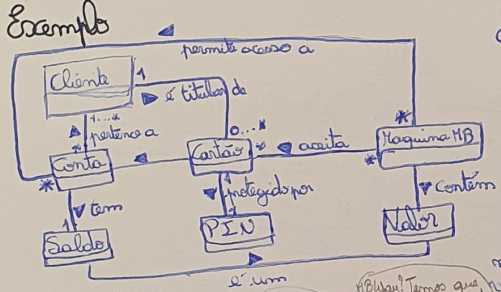
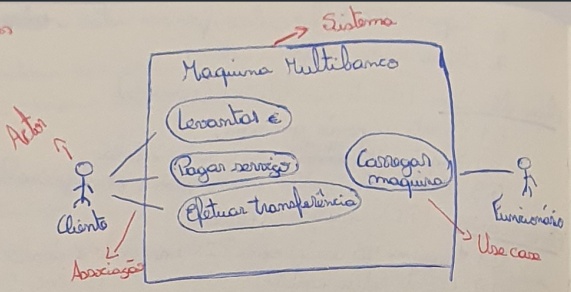
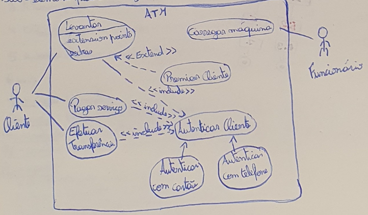

# Use Cases

Requisitos *funcionais* - O que o sistema deve fazer.
Requisitos *não funcionais* - Como o sistema deve fazer.

## Validação dos requisitos

 - Completa - Todos os aspetos relevantes foram considerados;
 - Consistente - Não existem contradições entre requisitos;
 - Inequivoca - Os requisitos pode ser interpertado de formas diferentes;
 - Correta - Os requisitos descrevem corretamente o que o cliente pretende e o que a equipa de desenvolvimento se propõe a fazer;
 - Realista - Não se deve prometer o que não podemos realizar;
 - Verificavel - Temos que poder saber se cumprimos os objetivos;
 - Rastreavel - Temos que poder saber porque é que cada requisito doi definido;

### Exemplo

*Cenarios*:
 1. O João levanta 60€ com o cartão. O João vai viajar e dirige-se a uma maquina MB para levantar dinheiro para a viagem. Introduz o cartão e o codigo PIN quando tal é solicitado pela maquina. No menu escolhe a opção de levantamento de 60€. A maquina pergunta ao João se pretende um talão e ele responde que não. A maquina disponibiliza então o cartão e o valor pedido, que o João retira.
 2. O João levanta 10€ com MBway. (...)
 3. A Maria paga a conta da luz. (...)
 4. O Rui trasnfere a mesada para a conta da filha. (...)
 5. A Joana abastece a maquina com notas. (...)
 6. (...)

 

 **Use Case** : Levantar;
 **Descrição** : Cenarios 1 e 2;
 **Pré-condição** : Sistemas tem notas;
 **Pós-condição** : Cliente tem quantia desejada e saldo da conta foi atualizado;
 **Fluxo normal** :
  1. Cliente apresenta cartão e PIN;
  2. Maquina MB valida acesso e pede operação;
  3. Cliente indica que pretende levantar dada quantia;
  4. Maquina MB pergunta se quer talão;
  5. Cliente responde que não;
  6. Maquina MB devolve cartão, fornece notas e atualiza saldo da conta;
  7. Cliente retira cartão e notas;
 **Fluxo alternativo** : [cliente quer talão] (passo 5)
  5.1 Cliente responde que sim;
  5.2 Maquina MB devolve cartão, notas e talão;
  5.3 Cliente retira cartão, notas e talão e atualiza saldo da conta;
 **Fluxo de exceção** : [PIN invalido] (passo 2)
  2.1 Maquina MB informa cliente que o PIN é invalido;
  2.2 Cliente retira cartão;
  2.3 Maquina MB retira cartão;
  2.4 Fim do caso de uso;
 **Fluxo alternativo** : [cliente quer autenticar-se com MBway] (passo 1)
 1.1 Cliente prime escolhe acesso com MBway;
 1.2 Maquina MB pede codigo MBway;
 1.3 Cliente indica codigo MBway;
 1.4 Regressa a 2;

 

 # Diagrama de Use Cases

Um exemplo de diagrama possivel para o exemplo anterior.

. Use Cases:
 - Levantar
 - Pagar serviços
 - Efetuar transferencia
 - Carregar maquina

. Atores:
 - Clientes
 - Funcionario

----------//----------

Sistema -> Defina as fronteiras da solução a desenvolver;
Atores -> Uma abstração para uma entidade fora do sistema;
       -> Uma ator modela um proposito (alguém que tem um interesse especifico no sistema) pode não mapear 1 para 1 com entidades no mundo real;
       -> O conjunto de todos os actores definem todas as formas de iteração de use cases;
Associação -> Representa comunicação entre o actor e o sistema - atraves de use cases;
           -> Pode ser bi-direcional ou uni-direcional;
           -> Não demonstra associações com sistemas externos;

*Include* :: relação de inclusão que não define ordem. O actor utiliza o use case base, quando o use case é executado, o use case incluido tambem é executado.
*Extend* :: permite adicionar um comportamento a um use case base, *sob certas condições*.
*Generalização/Especialização* : Sub-elementos são casos particulares de super-elementos. Um sub-elemento pode ser utilizado onde quer que um super elemento possa ser utilizado.

